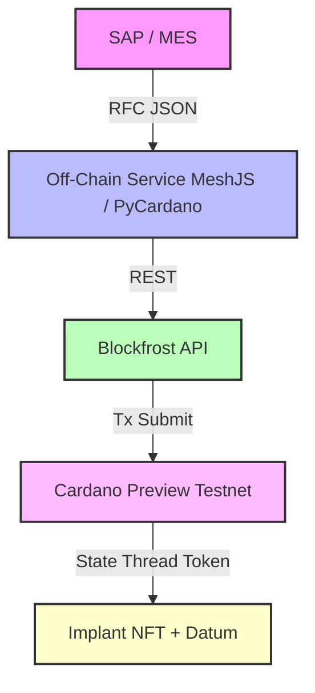

# Cardano-Implant 🦾  
Blockchain-gestützte Produktions- & Audit-Plattform für Implantate  
(Cardano Native Token + State-Thread-Token-Pattern, integrierbar in SAP / MES)

---

## Inhaltsverzeichnis
1. [Projektüberblick](#projektüberblick)  
2. [Architekturdiagramm](#architekturdiagramm)  
3. [Technische Umsetzung](#technische-umsetzung)  
4. [Voraussetzungen (macOS)](#voraussetzungen-macos)  
5. [Schnellstart](#schnellstart)  
6. [Projektstruktur](#projektstruktur)  
7. [Build- & Run-Workflows](#build--run-workflows)  
8. [Tests & CI](#tests--ci)  
9. [Eigene Schlüssel / IDs](#eigene-schlüssel--ids)  
10. [Troubleshooting](#troubleshooting)

---

## Projektüberblick
**Cardano-Implant** modelliert jedes hergestellte Implantat als **Cardano Native Token (CNT)** – abgesichert durch ein **Aiken-Policy-Script** im State-Thread-Token-Pattern (STT).  

Zusätzlich wird ein Giftcard-Modul bereitgestellt: eine NFT-basierte Geschenkkarten-Logik mit klassischer Mint/Redeem/Burn-Funktionalität (siehe onchain/validators/giftcard.ak).

So entsteht ein manipulationssicherer, lebenszyklusfähiger Digital-Twin für Implantate sowie ein vollständig integriertes Geschenkkarten-System:

- **Implantate:**  
  - **Mint:** Token entsteht beim ersten Fertigungsschritt.  
  - **Update:** Datum der STT-Script-Adresse wird in jeder Supply-Chain-Stufe erweitert.  
  - **Burn / Transfer:** Abschluss oder Ownership-Wechsel (z. B. an Klinik).

- **Giftcards:**  
  - **Mint:** Geschenkkarte wird ausgegeben.  
  - **Redeem:** Karte wird eingelöst.  
  - **Burn:** Karte wird ungültig gemacht.

Alle Off‑Chain-Transaktionen werden über **MeshJS** (TypeScript) bzw. **PyCardano** erzeugt und via **Blockfrost** auf dem **Cardano Preview-Testnetz** eingereicht.

---

## Architekturdiagramm


---

## Technische Umsetzung

### 1 · On-Chain (Smart Policies)
| Use-Case          | Tool     | Pfad / Datei                             |
|-------------------|----------|------------------------------------------|
| Implant‑STT-Policy| **Aiken**| `onchain/validators/implant_stt.ak`      |
| Giftcard-Module   | **Aiken**| `onchain/validators/giftcard.ak`         |

- **Implant-STT-Policy**: sichert sequenzielle Updates per Operator-Signatur.  
- **Giftcard-Policy**: NFT-Geschenkkarten-Logik mit klassischem Mint, Redeem und Burn.

**Kompilieren + Blueprint**  
```bash
cd onchain
# Beides in einem Durchlauf
aiken build
# JSON mit allen Scripts + PolicyIDs
aiken blueprint > blueprint.json
```

---

### 2 · Script-Adresse ableiten (cardano-cli)

1. **Hex-Code extrahieren**  
   ```bash
   jq -r '.validators[] | select(.title=="implant_stt.implant_stt.mint").compiledCode' blueprint.json \
     > ../scripts/implant_stt.cbor.hex
   ```  
2. **Binär-Script erzeugen**  
   ```bash
   xxd -r -p scripts/implant_stt.cbor.hex scripts/implant_stt.plutus
   ```  
3. **Address generieren**  
   ```bash
   cardano-cli address build \
     --payment-script-file scripts/implant_stt.plutus \
     --testnet-magic 1 \
     --out-file scripts/implant_stt.addr
   ```  

> Die so erzeugte `scripts/implant_stt.addr` ist eure **STT_SCRIPT_ADDRESS**.

---

### 3 · Off-Chain (Tx-Builder)

- **MeshJS (TS)** für Mint/Update/Burn-Txs  
- Netzwerk-Layer: **Blockfrost** API (Preview)

**Beispiel (MeshJS / TS)**
```ts
import * as dotenv from "dotenv";
dotenv.config();

import express from "express";
import bodyParser from "body-parser";
import fs from "fs";
import path from "path";
import { TxBuilder, Data, BlockfrostProvider } from "@meshsdk/core";

// Blueprint laden
const blueprint = JSON.parse(
  fs.readFileSync(path.resolve(__dirname, "../../onchain/blueprint.json"), "utf-8")
);
const { compiledCode: sttScript, hash: policyId } =
  blueprint.validators.find((v: any) => v.title === "implant_stt.implant_stt.mint")!;
const provider = new BlockfrostProvider(process.env.BLOCKFROST_KEY!, "preview");
// eure Script-Adresse
const sttAddr = fs.readFileSync("scripts/implant_stt.addr", "utf-8").trim();

const app = express();
app.use(bodyParser.json());

function newBuilder() {
  return new TxBuilder()
    .setProvider(provider)
    .attachScript(Buffer.from(sttScript, "hex"))
    .setPolicyId(policyId);
}

app.post("/mint", async (req, res) => { /* ... */ });
app.post("/update", async (req, res) => { /* ... */ });
app.post("/burn", async (req, res) => { /* ... */ });
```
> **Tipp**: Ersetze `sttAddr` durch den Inhalt von `scripts/implant_stt.addr`.

---

## Voraussetzungen (macOS)

| Tool                    | Version ≥ | Installation                                                |
|-------------------------|-----------|-------------------------------------------------------------|
| Git                     | 2.40      | `brew install git`                                          |
| Aiken CLI               | 1.0-beta  | `curl -sSfL https://install.aiken-lang.org | bash`          |
| Node.js                 | 20        | `brew install node`                                         |
| pnpm                    | 8         | `npm i -g pnpm`                                             |
| Docker Desktop          | 25.x      | https://docker.com                                          |
| cardano-cli             | latest    | https://github.com/input-output-hk/cardano-node/releases    |
| VS Code                 | –         | Erweiterungen: *Dev Containers*, *Aiken Syntax*            |

---

## Schnellstart
```bash
# 1. Repo klonen
git clone https://github.com/<org>/cardano-implant.git
cd cardano-implant

# 2. On-Chain kompilieren
cd onchain
aiken build
aiken blueprint > blueprint.json
cd ..

# 3. Adresse erzeugen (siehe oben)

# 4. .env anlegen
cat <<EOF > .env
BLOCKFROST_KEY=<dein_preview_blockfrost_key>
PORT=3000
EOF

# 5. Off-Chain TS starten
cd offchain/ts
pnpm install
pnpm dev
```

---

## Projektstruktur
```text
onchain/            Aiken-Policies + blueprint.json
offchain/ts/        TypeScript-Service (MeshJS + Express)
scripts/            Hex, .plutus, .addr
sap/                RFC-Stub (ABAP)
db/                 AES-verschlüsselte Patientendaten
docs/               Diagramme, Mermaid etc.
```

---

## Build- & Run-Workflows

| Aufgabe                 | Befehl                                            |
|-------------------------|---------------------------------------------------|
| Aiken Compile           | `aiken build`                                     |
| Blueprint exportieren   | `aiken blueprint > onchain/blueprint.json`       |
| Script-Adresse ableiten | siehe [Technische Umsetzung](#2--script-adresse-ableiten) |
| Off-Chain build (TS)    | `pnpm install && pnpm build`                     |
| Off-Chain dev (TS)      | `pnpm dev`

---

## Tests & CI
- **On-Chain-Tests:** `aiken test`  
- **Off-Chain-Unit-Tests:** Jest / PyTest  
- **CI/CD:** GitHub Actions → Aiken-Build + Off-Chain-Tests + Preview-Deploy

---

## Eigene Schlüssel / IDs

| Was                   | Wo                               | Hinweis                          |
|-----------------------|----------------------------------|----------------------------------|
| Blockfrost-API-Key    | ENV `BLOCKFROST_KEY`             | kostenlos auf blockfrost.io      |
| Operator-Skeys        | `offchain/keys/`                 | `cardano-cli address key-gen`    |
| AES-Key               | ENV `PATIENT_KEY`                | 32-Byte Hex                      |

---

## Troubleshooting

| Problem                         | Lösung                                                        |
|---------------------------------|---------------------------------------------------------------|
| Token minten schlägt fehl       | ADA vom Preview-Faucet holen & UTxO korrekt setzen            |
| Script Redeemer mismatch        | Blueprint neu generieren & Policy ID prüfen                   |
| Blockfrost 403                  | Preview statt Mainnet verwenden                               |
| TypeScript Import-Fehler        | In `tsconfig.json` `{"compilerOptions":{"esModuleInterop":true, …}}` aktivieren |

---

## Lizenz
MIT – frei nutz- & anpassbar.
