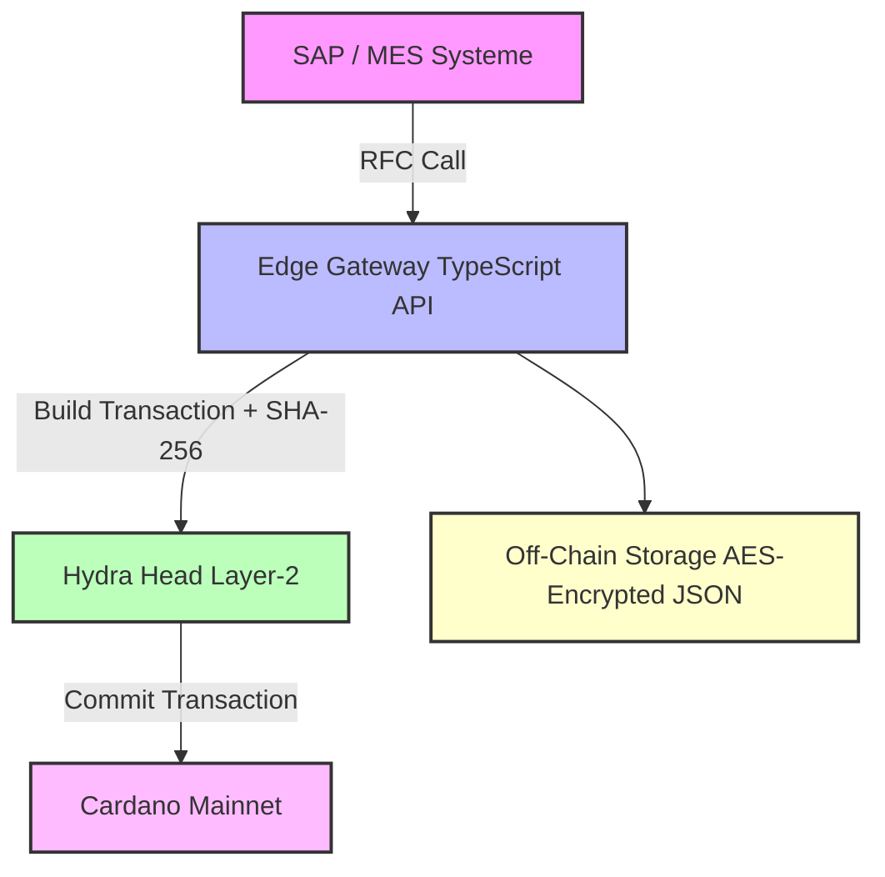

# Cardano-Implant 🦾  
Blockchain-gestützte Produktions- & Audit-Plattform für Implantate  
(Cardano Mainnet + Hydra-L2, komplett integrierbar in SAP / MES)

---

## Inhaltsverzeichnis
1. [Projektüberblick](#projektüberblick)  
2. [Architekturdiagramm](#architekturdiagramm)  
3. [Technische Umsetzung](#technische-umsetzung)  
4. [Voraussetzungen (macOS)](#voraussetzungen-macos)  
5. [Schnellstart](#schnellstart)  
6. [Projektstruktur](#projektstruktur)  
7. [Build- & Run-Workflows](#build--run-workflows)  
8. [Tests & CI](#tests--ci)  
9. [Eigene Schlüssel / IDs](#eigene-schlüssel--ids)  
10. [Troubleshooting](#troubleshooting)

---

## Projektüberblick
**Cardano-Implant** bildet alle Fertigungs-, Prüf- und Genehmigungs­schritte für Implantate transparent und unveränderlich auf der Blockchain ab.

* Prozess­schritte **lokal** mit **Hydra L2** schnell & kostengünstig  
* Finaler Audit-Hash auf **Cardano Mainnet**  
* Vertrauliche Daten **Off-Chain** (AES-verschlüsselt)

---

## Architekturdiagramm


---

## Technische Umsetzung

### Idee in einem Satz  
> Jeder Produktions- und QC-Schritt wird sofort als signierte Transaktion in einem lokalen Hydra-Head festgeschrieben; alle paar Minuten sichert ein Merkle-Root auf Cardano Mainnet die globale Unveränderlichkeit.

### Layer-Überblick  

| Schicht | Aufgabe | Technologie |
|---------|---------|-------------|
| **SAP / MES** | Bediener erfasst Schritt, sendet RFC | SAP RFC |
| **Edge-Gateway** | wandelt IDoc → JSON, berechnet SHA-256, baut Tx | TypeScript + cardano-cli |
| **Hydra-Head** | > 10 000 Tx/s, gebührenfrei | hydra-node 0.20 |
| **Plutus-Validator** | erzwingt Schrittfolge + Operator-Signatur | Haskell / Plutus V3 |
| **Cardano Mainnet** | speichert Batch-Root | CSL (Ouroboros PoS) |
| **Off-Chain-DB** | verschlüsselte Detail-Daten & Bilder | Postgres, MinIO |
| **CI/CD** | reproducible Builds & Tests | Dev-Container, GitLab CI |

### Ablauf eines Schritts (Beispiel *LaserMark*)  

1. **Operator** bestätigt Schritt in SAP → RFC JSON → Edge-Gateway.  
2. Gateway speichert JSON verschlüsselt, erzeugt `metaHash`, bildet Plutus-Datum (`ImplantId`,`Step`,`OperatorPKH`,`metaHash`).  
3. Transaction an **Hydra-Head** → lokale Finalität < 1 s.  
4. **Head** bündelt Batch-Hashes; alle 5 min Commit-Tx zum Mainnet.  
5. Auditor prüft später Hash = unveränderter Original-Datensatz.

### Smart-Contract-Logik  

```
MaterialIn → DeepDraw → ThreadCut → SandBlast → LaserMark → VisualQC → FinalQC
```

* Nur definierte Übergänge erlaubt (`allowedNext`).  
* Jedes State-Update muss vom **PubKeyHash des Operators** signiert sein.  

### Datenschutz / DSGVO  

* Personen- oder Rezept­daten **nur Off-Chain**, verschlüsselt.  
* On-Chain liegt ausschließlich der Hash – kein Personen­bezug.  

### Betrieb & Skalierung  

* 3 Hydra-Knoten (SmartBFT) → zuverlässiges L2-Cluster.  
* Energiebilanz: PoS + off-chain-Batches ⇒ < 0.01 kWh pro 1 000 Tx.  
* Zukunftssicher: Midnight-Sidechain (ZK-Privacy) kann später andocken.

---

## Voraussetzungen (macOS)

| Tool | Version ≥ | Installation |
|------|-----------|--------------|
| Git | 2.40 | `brew install git` |
| Docker Desktop | 25.x | <https://www.docker.com/products/docker-desktop> |
| Visual Studio Code | 1.88 | <https://code.visualstudio.com/> |
| VS-Code-Extensions | Dev Containers, Haskell, Prettier | Marketplace |

> Cardano-CLI, Hydra-Node, GHC, pnpm etc. werden vom **Dev-Container** bereitgestellt.

---

## Schnellstart
```bash
git clone https://github.com/https://github.com/MikeDiethelm/BA-2025.git
cd cardano-implant
code .                # „Reopen in Container?“ → Yes

# Terminal 1
task Hydra Head       # Hydra-Cluster

# Terminal 2
pnpm -C offchain/edge-gw dev  # Edge-Gateway

# Demo-Aufruf
curl -X POST http://localhost:8080/v1/step \
     -H 'Content-Type: application/json' \
     -d @sap/example_step.json
```

---

## Projektstruktur
```plaintext
.devcontainer/    Dev-Container (Dockerfile + json)
.vscode/          Tasks & Debug-Configs
plutus/           On-Chain-Code (Haskell)
hydra/            Hydra-Konfig + Start-Script
offchain/edge-gw/ API-Gateway (TypeScript)
db/               AES-verschlüsselte Patientendaten
sap/              RFC-Stub
cicd/             GitLab-CI-Pipeline
```

---

## Build- & Run-Workflows

| Aktion | Befehl (Container) | Ergebnis |
|--------|--------------------|----------|
| Build Haskell + TS | `⇧⌘B` / `Ctrl⇧B` | kompiliert alles |
| Hydra starten | Task **Hydra Head** | L2-Cluster auf :4001 |
| Gateway Debug | Run ▶ **Debug Edge-GW** | Breakpoints, Hot-Reload |
| Unit-Tests | `cabal test all` | Plutus-Tests |
| Plutus-Export | `plutus-compile …` | `implant.plutus` |

---

## Tests & CI
* **Unit-Tests:** `plutus/test/ValidatorSpec.hs`  
* **CI/CD:** `cicd/.gitlab-ci.yml` → Container-Build, Tests, Artefakte.

---

## Eigene Schlüssel / IDs

| Platzhalter | Datei | Bedeutung |
|-------------|-------|-----------|
| Script-Tx-IDs | `hydra/configs/hydra-mainnet.yaml` | Hydra-Scripts im Mainnet |
| Wallet-Addr. + UTxO | JSON-Payload | echte Cardano-Konten |
| `.vkey / .skey` | `hydra/keys/` | Operator-Schlüssel |
| `PATIENT_KEY` | ENV-Variable | AES-Key DB-Verschlüsselung |

---

## Troubleshooting

| Problem | Lösung |
|---------|--------|
| Docker-Build langsam | erster Build cached Layers |
| `cardano-cli` fehlt | Terminal im Dev-Container öffnen |
| Hydra „waiting…“ | alle Party-Keys / Init prüfen |
| M-Chip `exec format` | Dockerfile → `--platform=linux/amd64` |

---

