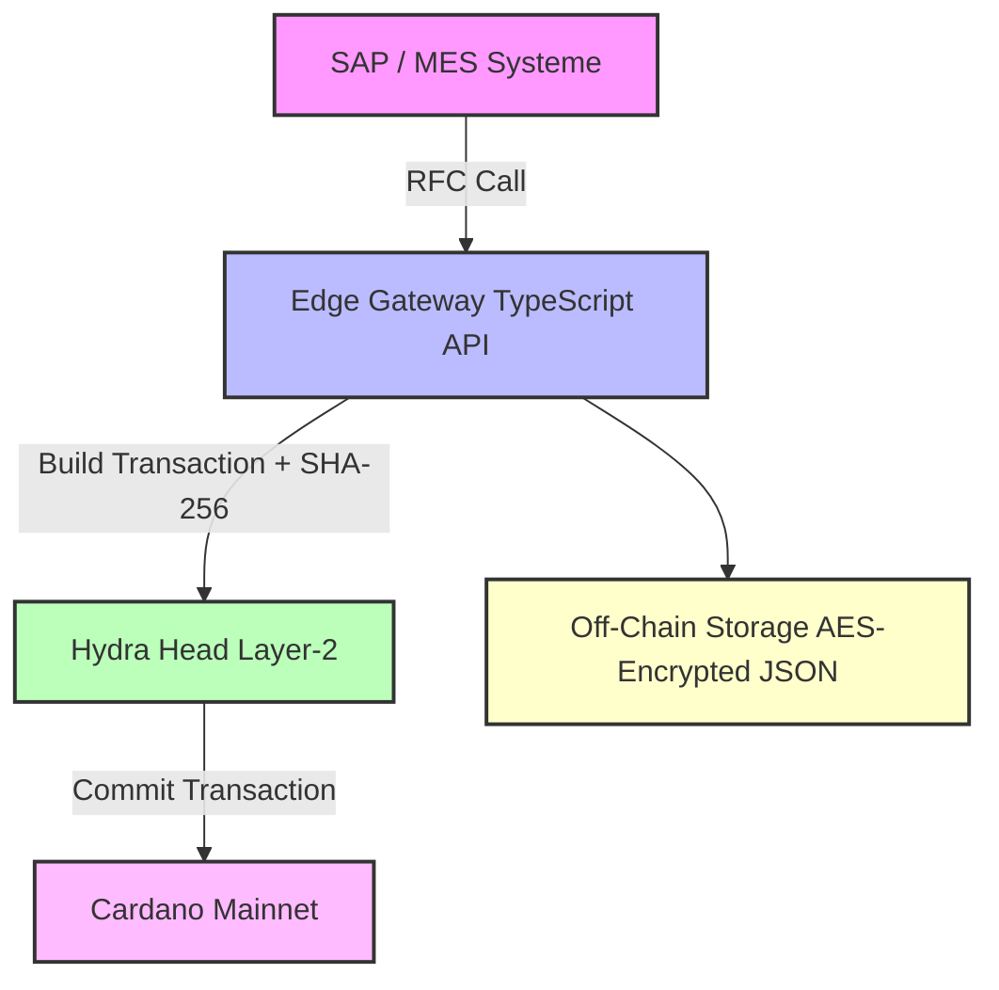

# Cardano-Implant 🦾  
Blockchain-gestützte Produktions- & Audit-Plattform für Implantate  
(Cardano Mainnet + Hydra-L2, komplett integrierbar in SAP / MES)

---

## Inhaltsverzeichnis
1. [Projektüberblick](#projektüberblick)
2. [Architekturdiagramm](#architekturdiagramm)
3. [Voraussetzungen (macOS)](#voraussetzungen-macos)
4. [Schnellstart](#schnellstart)
5. [Projektstruktur](#projektstruktur)
6. [Build- & Run-Workflows](#build--run-workflows)
7. [Tests & CI](#tests--ci)
8. [Eigene Schlüssel / IDs](#eigene-schlüssel--ids)
9. [Troubleshooting](#troubleshooting)

---

## Projektüberblick

**Cardano-Implant** bildet alle Fertigungs-, Prüf- und Genehmigungsprozesse für Implantate transparent und unveränderlich auf der Blockchain ab.  
Dabei werden:

- Prozessschritte **lokal** mit **Hydra L2** schnell und günstig verarbeitet
- Ein finaler Audit-Hash auf **Cardano Mainnet** verankert
- Vertrauliche Patientendaten **Off-Chain** gespeichert (AES-verschlüsselt)

---

## Architekturdiagramm

## Architekturdiagramm



---

## Voraussetzungen (macOS)

| Tool                   | Version ≥ | Installieren über                        |
|-------------------------|-----------|-----------------------------------------|
| Git                     | 2.40      | `brew install git`                      |
| Docker Desktop          | 25.x      | [Docker Desktop](https://www.docker.com/products/docker-desktop) |
| Visual Studio Code      | 1.88      | [VS Code](https://code.visualstudio.com/) |
| VS-Code Extensions      | -         | Dev Containers, Haskell, Prettier       |

> Hinweis: Cardano CLI, Hydra Node, GHC, pnpm etc. sind bereits im Dev-Container enthalten.

---

## Schnellstart

```bash
git clone https://github.com/<dein-org>/cardano-implant.git
cd cardano-implant
code .                      # "Reopen in Container?" → Ja

# Terminal 1 (im Container)
task Hydra Head              # startet Hydra-Node

# Terminal 2 (im Container)
pnpm -C offchain/edge-gw dev  # startet Edge-Gateway (Hot Reload)

# Beispiel-Step senden:
curl -X POST http://localhost:8080/v1/step \
     -H 'Content-Type: application/json' \
     -d @sap/example_step.json
```

Nach erfolgreichem Submit siehst du eine Hydra-TX-ID im Log.

---

## Projektstruktur

```plaintext
.devcontainer/    # Dockerfile + Dev-Container-Config
.vscode/          # Build-Tasks, Debug-Launcher
plutus/           # On-Chain-Code (Haskell) + Tests
hydra/            # Hydra-Head Konfiguration
offchain/edge-gw/ # TypeScript Gateway (API)
db/               # Patientendaten (verschlüsselt)
sap/              # SAP RFC-Stub
cicd/             # CI/CD-Pipeline (GitLab)
docs/architecture.png # Architektur-Diagramm
```

---

## Build- & Run-Workflows

| Aktion                  | Befehl / Shortcut        | Ergebnis                        |
|--------------------------|---------------------------|---------------------------------|
| Plutus + TS Build        | `⇧⌘B` / `Ctrl⇧B`           | kompiliert Haskell + Gateway    |
| Hydra Node starten       | Task `Hydra Head`          | Hydra-Head auf Port :4001       |
| Edge-Gateway debuggen    | Menü → Run ▶ Debug Edge-GW | Breakpoints & Live-Reload aktiv |
| Plutus Tests ausführen   | `cabal test all`           | Unit-Tests auf Prozesslogik     |
| Smart Contract exportieren| `plutus-compile …`        | erzeugt `implant.plutus`        |

---

## Tests & CI

- Unit-Tests: `plutus/test/ValidatorSpec.hs`
- CI/CD (`cicd/.gitlab-ci.yml`):
  - Build Dev-Container
  - Haskell Unit-Tests
  - Build-Artefakt `implant.plutus`

---

## Eigene Schlüssel / IDs

| Platzhalter           | Datei                          | Beschreibung |
|------------------------|--------------------------------|--------------|
| Hydra Script-IDs       | `hydra/configs/hydra-mainnet.yaml` | aktuelle Hydra Deployments |
| Wallet-Adressen / UTxO | JSON-Payload ans Gateway        | echte Cardano Wallets |
| Operator-Keys (.vkey/.skey) | `hydra/keys/`                | via `cardano-cli address key-gen` |
| AES Schlüssel (PATIENT_KEY) | Umgebungsvariable für DB    | schützt Patienten-Off-Chain-Daten |

---

## Troubleshooting

| Problem                             | Lösung |
|-------------------------------------|--------|
| Container-Build dauert lange        | Erstes Build cached alles – danach schnell |
| `cardano-cli` nicht gefunden         | Sicherstellen, dass Terminal im Container läuft |
| Hydra Head hängt bei "waiting"      | Alle Party-Keys und Head-Init korrekt setzen |
| M1/M2 Fehler "exec format"           | In Dockerfile `--platform=linux/amd64` setzen |

